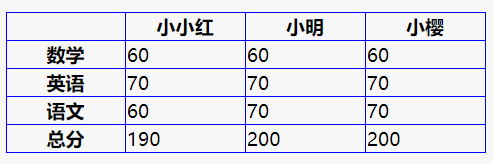

# HTML常用标签
# a标签
## 作用
1. 跳转外部页面
2. 跳转内部锚点 
3. 跳转到邮箱或电话等
***
## 属性
1. href ——用来表示超链接指向的地址
2. target ——用来表示在何处显示链接资源
3. download —— 很多浏览器不支持(不做要求)
4. rel=noopener 需要js知识
### href(超链接，可以在终端用hs -c-1来打开页面预览)
  #### 网址
  ~~~
  https：
  ~~~
  
 ~~~
  http：
  ~~~
  ~~~
  
  ~~~
  **注意**：推荐这种写法，//会自行选择https还是http，可以避免输错地址。
  #### 路径
  * /a/b/c 此时的根目录是 hs -c-1的目录
  * a/b/c 在文件所处的目录下，找到a里的b里的c文件
  * index.html 以及 ./index.html 打开当前目录里的 index.html(直接写文件名)

#### 伪协议
1. javascript:;空的就是什么都不做，加参数就是直接执行。
~~~
<a href="javascript:alert(1);">JavaScript伪协议</a>
<a href="javascript:;">空的伪协议</a>
~~~
2. mailto:邮箱 —— 点击后打开默认的邮件软件
3. tel:手机号 ——手机中点击后可以提示是否拨号
#### id href=#xxx ——页面滚动到id为xxx的元素所在行
### target
* _blank ——在新页面打开
* _top ——在当前页面的顶级窗口里打开
* _parent ——在连接所在的上一级窗口打开·
* _self —— 在当前窗口打开（默认值是self）
### 程序员的命名
* window 的 name ——始终在名为xxx的窗口打开网址，如果当前没有xxx窗口，就创建一个
* iframe 的 name ——使用某个iframe打开链接 （iframe内嵌窗口，现在用得少，不好用）

# table标签
## 相关的标签
* table
* thead表头>tr>th
* tbody表的身体>tr>td
* tfoot表的结尾(可以不写)>tr>td(结尾有表头的话要加th)
* th
* tr
* td
~~~
<!DOCTYPE html>
<html>
<head>
  <meta charset="utf-8">
  <title>JS Bin</title>
  
</head>
<body>
  <table>
    <thead>
      <tr>
        <th></th>
        <th>小小红</th>
        <th>小明</th>
        <th>小樱</th>
      </tr>
    </thead>
    
    <tbody>
      <tr>
        <th>数学</th>
        <td>60</td>
        <td>60</td>
        <td>60</td>
      </tr>
      <tr>
        <th>英语</th>
        <td>70</td>
        <td>70</td>
        <td>70</td>
      </tr>
      <tr>
        <th>语文</th>
        <td>60</td>
        <td>70</td>
        <td>70</td>
      </tr>
    </tbody>
    
    <tfoot>
      <tr>
        <th>总分</th>
        <td>190</td>
        <td>200</td>
        <td>200</td>
      </tr>
    </tfoot>
  </table>
</body>
</html>
~~~
**例子** 
### 相关样式
* table-layout
    * auto：自动计算横竖排的宽高
    * fixed：尽量平均

* border-collapse
     * collapse：合并，border-collapse意思就是border之间是否合并
     * `border-collapse:collapse;`

* border-spacing
     * 格子之间的空隙，控制border和border之间的距离
     * `border-spacing:20px;`
--- 

# img 标签
## 作用
发出git请求，展示一张图片
## 属性
* alt —— 图片下载失败时，显示的提示文字
* hight —— 这是img的属性，不是css，单写高度，宽度自适应
* width —— 这是img的属性，不是css，单写宽度，高度自适应，高度宽度都写，图片可能会变形
* src

## 事件
onload/onerror监听图片是否加载成功
## 响应式
max-width : 100% ----当图片宽度大于浏览器宽度时，图片宽度会和浏览器宽度相等(方便在手机上浏览)
## 例子
~~~
<!DOCTYPE html>
<html lang="en">
<head>
    <meta charset="UTF-8">
    <meta name="viewport" content="width=device-width, initial-scale=1.0">
    <title>img标签</title>
    
</head>
<body>
    
    
</body>
</html>
~~~
# form标签
## 作用
发get或post请求，然后刷新页面
## 属性
* action 控制请求页面的地址
* autocomplete 
     * 加了on，会提示要填写的内容
     * 写off就不会提示

* target 决定提交到哪个页面

## 事件
submit事件，就是当用户点提交的时候，就会触发这个事件
## input/button标签里type属性值submit的区别
input里不能再加标签，只能有纯文本
button里面可以有任何东西，如图片等

# input标签
* input type = "text"普通文本
* color 有颜色
* password 不显示输入内容，用圆点表示
* radio 单选，两个内容的名字相同就可以进行二选一
* CheckBox 多选
* file 上传一个文件，+multiple就可以上传多个文件
* hidden 看不见，不是给人类用户的，是给机器输入的

### textarea 可以输入多行文字,可以拖动来控制大小，也可以加style来控制，是单独的标签。
### `select <option value="1">星期一</option>` 下拉菜单,星期一是给用户看的，value中的是真正的值。

**注意**
1. 一般不监听input的dick事件
2. form里面的input要有name
3. form里面要放一个type="submit"才能触发submit事件

       
  